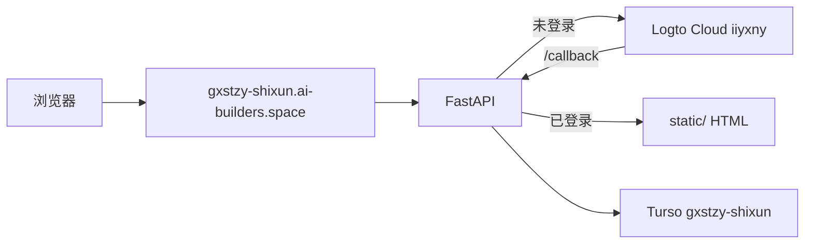

# 实训科管理平台 · 云端部署归档

> **编制单位**：教务处 · 实训管理科  
> **归档时间**：2026年08月19日  
> **线上地址**：https://gxstzy-shixun.ai-builders.space  
> **公开仓库**：https://github.com/PengGangjie/gxstzy-shixun-platform

---

## 一、架构概览

| 层级 | 选型 | 说明 |
|------|------|------|
| 身份（Identity） | **Logto Cloud** | OIDC / Traditional Web；校园网不依赖 Google |
| 数据库 | **Turso（libSQL）** | 边缘 SQLite；Python 连接须用 `https://` URL |
| 应用 | **FastAPI + StaticFiles** | 单进程托管原静态 HTML 平台 |
| 运行 | **AI Builder Space** | `service_name` = `gxstzy-shixun` |
| 备选（未采用） | Firebase Auth | 校园网 Google Identity 不稳定，仅作备选 |



---

## 二、目录与文件索引

### 2.1 可部署工程（FastAPI）

| 路径 | 说明 |
|------|------|
| `c:\00CS\text\output\gxstzy-shixun-platform\` | 部署工程根目录（独立 git 仓库） |
| `app\main.py` | Logto 登录 / 静态托管 / 鉴权中间件 |
| `app\config.py` | 环境变量读取；`libsql://` 自动转 `https://` |
| `app\db.py` | Turso 连通与用户 upsert |
| `static\` | 同步自本地平台的脱敏 Demo 静态文件 |
| `Dockerfile` | Python 3.11-slim + uvicorn |
| `deploy-config.json` | Space 部署元数据（**不含密钥**） |
| `README.md` | 本地运行与 Space 说明 |

### 2.2 静态平台真源（本地开发）

| 路径 | 说明 |
|------|------|
| `c:\00CS\text\output\gxstzy-future-lab-plan\` | 原静态平台；完整台账数据仍在此 |
| `广西生态工程职业技术学院-教务处-实训科管理平台-归档.md` | 2026-07-14 本地版归档索引 |

### 2.3 密钥与模板（勿提交 git / 勿进公开仓）

| 路径 | 说明 |
|------|------|
| `c:\00CS\text\secrets\shixun-platform\.env` | 运行时环境变量（Logto + Turso + SESSION） |
| `secrets\shixun-platform\logto.credentials.json` | Logto 应用配置（含 Secret，仅本机） |
| `secrets\shixun-platform\turso.credentials.json` | Turso URL + Token（仅本机） |
| `secrets\shixun-platform\env.template` | 凭证模板 |
| `secrets\shixun-platform\turso.schema.sql` | 数据库初始 DDL |
| `secrets\shixun-platform\TURSO_SETUP.md` | Turso 网页建库步骤（Windows 无 CLI） |
| `*.example.json` | 脱敏示例，可对照填写 |

### 2.4 脚本

| 脚本 | 用途 |
|------|------|
| `scripts\sync_shixun_platform_static.py` | `future-lab-plan` → `gxstzy-shixun-platform/static` |
| `scripts\init_turso_schema.py` | 初始化 Turso 表并验收 `schema_version` |
| `scripts\write_shixun_cloud_credentials.py` | 从环境变量写入 credentials 文件 |
| `scripts\deploy_gxstzy_shixun_space.py` | 调用 Space API 部署（密钥从本地 `.env` 注入） |

### 2.5 选型 Canvas

| 路径 | 说明 |
|------|------|
| `canvases\shixun-cloud-stack.canvas.tsx` | Firebase vs Logto + Turso 对比结论（Cursor Canvas） |

---

## 三、Logto 配置

| 项 | 值 |
|----|-----|
| Tenant | `iiyxny` |
| Endpoint | `https://iiyxny.logto.app/` |
| 应用名 | `gxstzy-shixun-v2`（当前有效；旧 `gxstzy-shixun-platform` / `p57b49oaxrbmyqkiowrx` 已被 OIDC 拒绝） |
| 类型 | Traditional Web |
| App ID | `bbmxu4hpufzkorzhilvl9` |
| App Secret | 见 `secrets/shixun-platform/logto.credentials.json`（**勿写入本文档**） |

**Redirect URIs（须逐条添加，勿写在同一行）：**

1. `https://gxstzy-shixun.ai-builders.space/callback`（生产）
2. `http://127.0.0.1:8000/callback`（本地）

**Post sign-out redirect URIs：**

1. `https://gxstzy-shixun.ai-builders.space/`
2. `http://127.0.0.1:8000/`

**路由对照（FastAPI）：**

| 路径 | 作用 |
|------|------|
| `/sign-in` | 跳转 Logto 登录 |
| `/callback` | OIDC 回调，写入 session + upsert 用户 |
| `/sign-out` | Logto 登出 |
| `/api/me` | 当前登录状态 JSON（含 email / phone） |

### 3.1 手机号登录（短信验证码）

手机登录由 **Logto 托管登录页** 完成，不在 FastAPI 里另做表单。应用已请求 OIDC scope `phone`，登录后会写入 Turso `users.phone`。

**控制台步骤：**

1. **Connectors → Email and SMS** → Set up SMS
2. 国内推荐 **Aliyun SMS** 或 **Tencent SMS**（需企业实名 + 签名「广西生态工程职业技术学院」或学校简称）
3. 模板须覆盖 Logto 四种 `usageType`：`Register` / `SignIn` / `ForgotPassword` / `Generic`，正文含验证码占位 `{code}` 或 `{1}`
4. **Sign-in and account → Sign-up and sign-in**
   - Sign-up identifier 增加 **Phone number**（或 Email or phone）
   - Sign-in 增加 **Phone number + SMS verification code**
5. 保存后立刻生效，无需改代码；若 OIDC 尚未带 `phone` scope，需重部署本仓库（已含）

QQ 邮箱收不到验证码：是 QQ 把 Logto 默认邮件当垃圾信，把发件人移出垃圾箱即可；邮箱登录已通。

---

---

## 四、Turso 配置

| 项 | 值 |
|----|-----|
| 库名 | `gxstzy-shixun` |
| Org slug | `pumbaa0716` |
| Database URL | `libsql://gxstzy-shixun-pumbaa0716.aws-ap-northeast-1.turso.io` |
| Auth Token | 见 `secrets/shixun-platform/turso.credentials.json` |
| schema_version | `1`（2026-08-19 已初始化） |

**表结构：**

- `meta` — 键值元数据（含 `schema_version`）
- `users` — Logto `sub` / email / name / role
- `audit_log` — 操作审计
- `platform_snapshots` — 平台数据快照（预留）

**注意：** Python `libsql_client` 远程连接须用 `https://gxstzy-shixun-pumbaa0716.aws-ap-northeast-1.turso.io`，不能用 `libsql://` WebSocket。

---

## 五、Space 部署

| 项 | 值 |
|----|-----|
| service_name | `gxstzy-shixun` |
| 公网 URL | https://gxstzy-shixun.ai-builders.space |
| 仓库 | https://github.com/PengGangjie/gxstzy-shixun-platform |
| 分支 | `main` |
| 端口 | `8000` |
| 首次部署 | 2026-08-19 |
| 免费托管至 | 2027-08-19 |
| 健康检查 | `GET /health` → `{"status":"ok","db_schema_version":"1"}` |

**公开 `deploy-config.json` 仅含：**

```json
{
  "APP_MODE": "demo",
  "LOG_LEVEL": "info",
  "AUTH_REQUIRED": "true",
  "PUBLIC_BASE_URL": "https://gxstzy-shixun.ai-builders.space"
}
```

**部署时由脚本注入（不入 Git）：** `LOGTO_*`、`TURSO_*`、`SESSION_SECRET`、`LOGTO_REDIRECT_URI`、`LOGTO_POST_LOGOUT_URI`

```powershell
cd c:\00CS\text
.\venv\Scripts\python.exe scripts\deploy_gxstzy_shixun_space.py
```

依赖项目根 `.env` 中的 `AI_BUILDER_TOKEN`（全大写）。

---

## 六、本地开发与验证

```powershell
cd c:\00CS\text
.\venv\Scripts\python.exe scripts\sync_shixun_platform_static.py
cd output\gxstzy-shixun-platform
..\..\venv\Scripts\pip.exe install -r requirements.txt
..\..\venv\Scripts\uvicorn.exe app.main:app --host 127.0.0.1 --port 8000
```

1. 打开 http://127.0.0.1:8000/ → 应重定向 `/sign-in` → Logto
2. 登录后回到平台首页
3. `GET /health` 应返回 `ok` + `db_schema_version: 1`

---

## 七、静态平台模块（与本地版一致）

| 模块 | 线上相对路径 |
|------|-------------|
| 平台首页 | `/` 或 `/index.html` |
| 制度汇总 | `/platform-01-regulations.html` |
| 迎检文件 | `/platform-02-inspection.html` |
| 一室一表 | `/platform-03-yishi.html` |
| 日常管理台账 | `/platform-04-ledger.html` |
| 实训科业务 | `/platform-05-shixun-ke.html` |
| 未来实训室 | `/platform-06-future-lab.html` |
| 分级分类信息牌 | `/lab-grade-boards/` |
| 安全驾驶舱 | `/实训室安全数据驾驶舱.html` |

公开仓 `static/` 为**脱敏 Demo**；完整台账仍在 `gxstzy-future-lab-plan\`。

---

## 八、已知问题与待办

| 状态 | 项 | 说明 |
|------|-----|------|
| 已修复并上线 | 首页 500 | `SessionMiddleware` 后注册；commit `6b574e9` 已重部署，`/` → `/sign-in` → Logto |
| 已修复 | Logto `invalid_client` | 改用应用 `gxstzy-shixun-v2` / App ID `bbmxu4hpufzkorzhilvl9` |
| 进行中 | 手机号登录 | 代码已加 `phone` scope；待控制台配置阿里云/腾讯云短信连接器 |
| 已缓解 | `/callback` 裸 500 | 无 code 时回 `/sign-in`；会话丢失返回 400 JSON 说明 |
| 建议 | Post sign-out URI | Logto 控制台两条 URL 须**分别**点「Add another」，勿写在同一输入框 |
| 建议 | App Secret 轮换 | Secret 曾在对话/截图中出现，可在 Logto Console 轮换 |
| 建议 | 公开仓清理 | `static/一室一表未完成整改/` 等可能含内部信息，可移除或进一步脱敏 |
| 可选 | Firebase | 已装 `firebase-tools` 于 `tools/cloud-clis/`，当前栈未启用 |

---

## 九、经验摘要

1. **DuckDuckGo / Turso CLI**：国内 DuckDuckGo 不可用；Windows 无 WSL 时 Turso 走 Dashboard。
2. **libsql URL**：远程 Python 用 `https://`，本地 embedded 才用 `libsql://` 文件路径。
3. **Logto 回调**：`handleSignInCallback(str(request.url))` 须含 query 参数。
4. **Space 密钥**：`LOGTO_APP_SECRET`、`TURSO_AUTH_TOKEN` 走部署 API 注入，不进公开 GitHub。
5. **中间件顺序**：Starlette 后注册的 Middleware 更靠外层；Session 须包裹鉴权中间件。
6. **QQ 邮箱**：Logto 默认邮件常被 QQ 判为垃圾信，验证码进垃圾箱；不是平台代码问题。手机登录需国内短信通道（阿里云/腾讯云），Logto 无内置免费短信。

---

*教务处 · 实训管理科 · 2026年08月19日*
